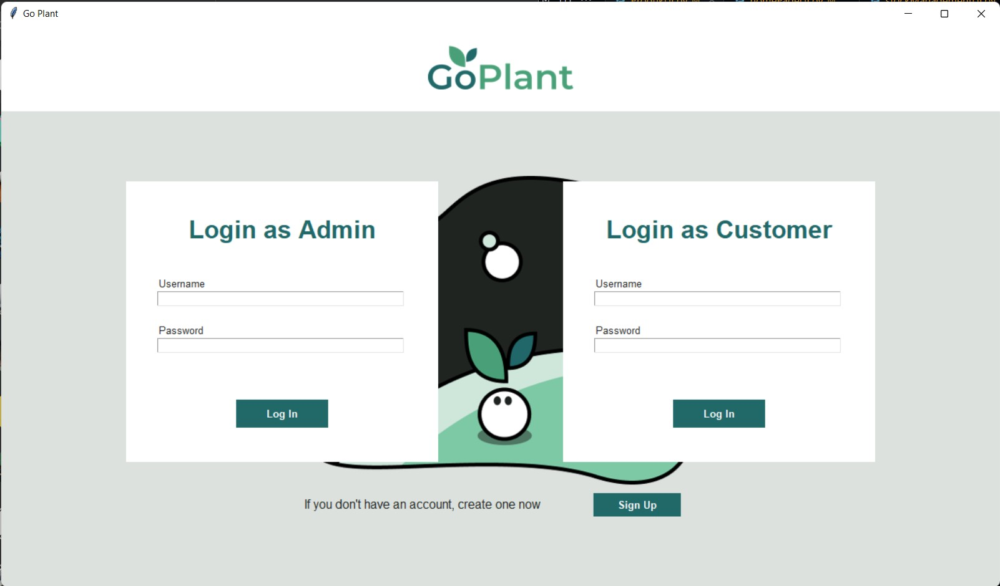
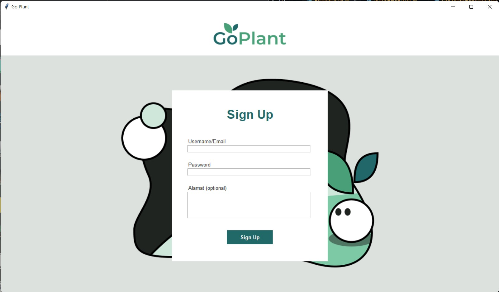
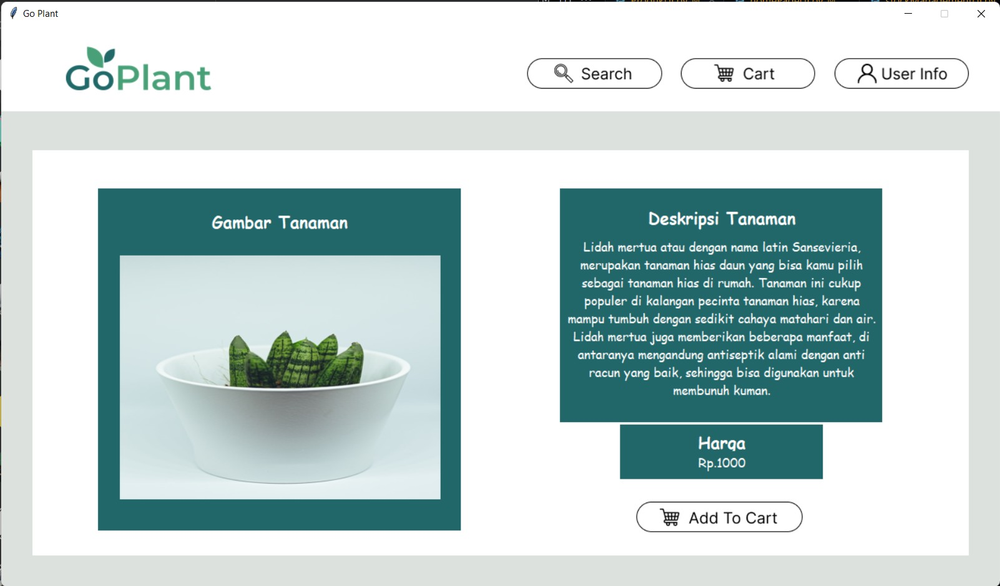
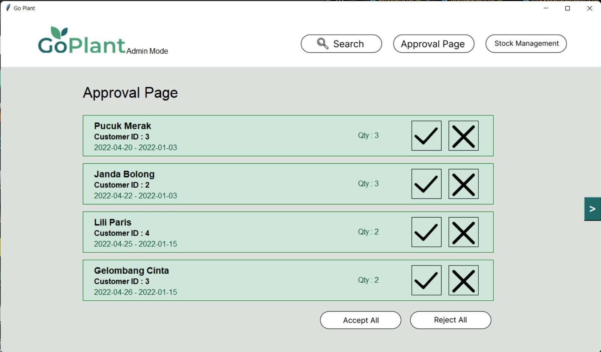
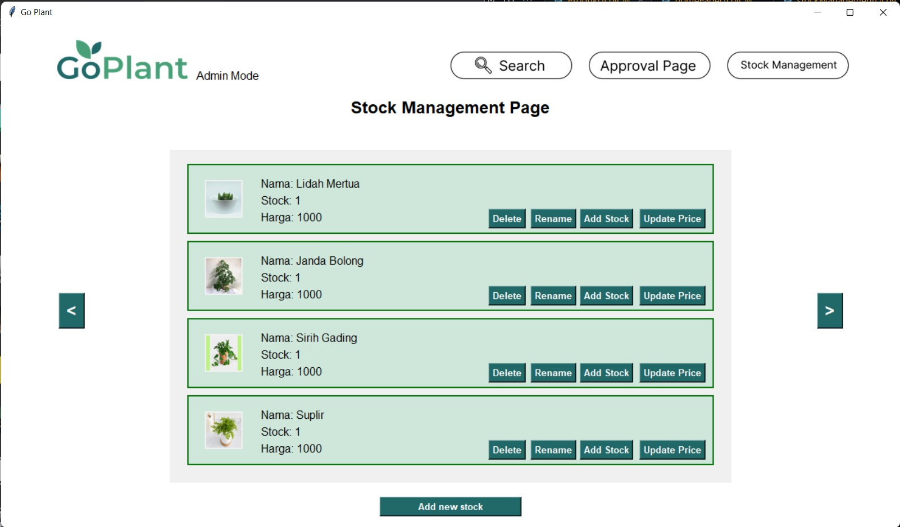
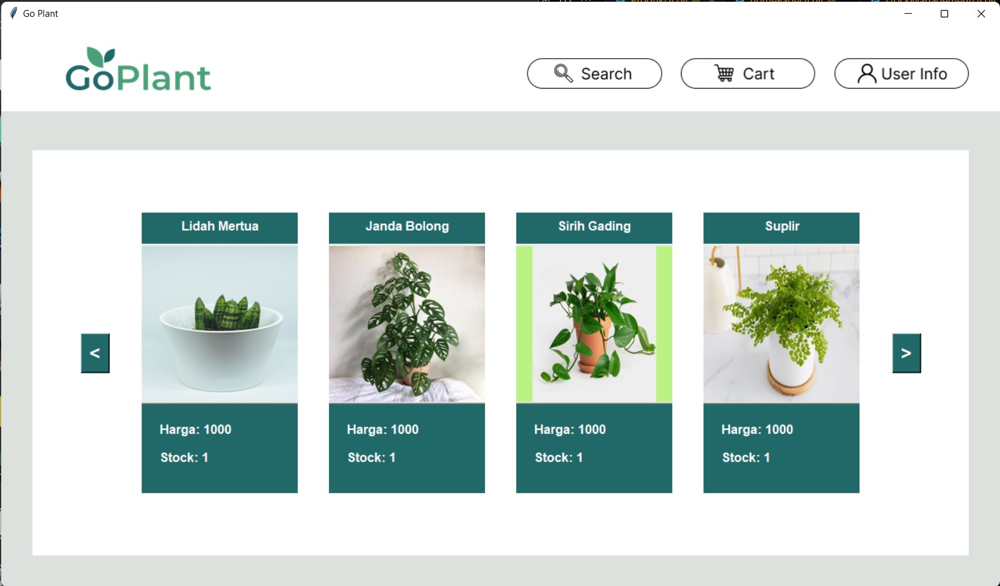
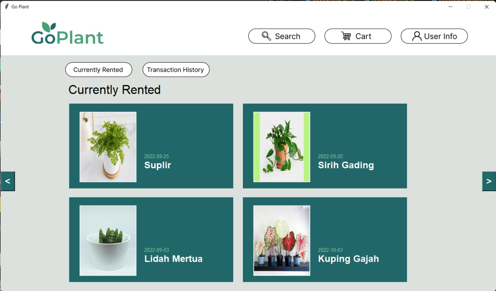

# Go-Plant
> Go-Plant adalah aplikasi untuk menyewa tanaman. Aplikasi ini dibuat untuk memenuhi tugas dari mata kuliah IF2250 Rekayasa Perangkat Lunak. 

## Cara Menjalankan Aplikasi
1. Clone Repository Ini
2. Buka Command Prompt / Terminal
3. Change Directory ke repository ini
4. Jalankan
```python src/GoPlant.py```
5. Selamat bereksplorasi!
>Jika terdapat masalah pada basis data, import basis data (```GoPlant.sql```) ke dalam database bernama ```goplant``` terlebih dahulu sebelum menjalankan aplikasi 

## Daftar Modul yang Diimplementasi
No. | Nama Modul | NIM & Nama PIC
--- | --- | --- 
1 | Login | 13520074 / Eiffel Aqila Amarendra
2 | Register | 13520074 / Eiffel Aqila Amarendra
3 | Penyewaan Tanaman | 13520041 / Ilham Pratama
4 | Persetujuan Penyewaan Tanaman | 13520164 / Hilda Carissa Widelia
5 | Manajemen Stok dan Jenis Tanaman | 13520104 / Yakobus Iryanto Prasethio
6 | Daftar Tanaman | 13520041 / Ilham Pratama
7 | Daftar Tanaman Sedang Disewa | 13520164 / Hilda Carissa Widelia

## Tabel Basisdata yang Diimplementasi
No. | Nama Tabel | Atribut
--- | --- | ---
1 | Admin | (id_admin, username)
2 | Pelanggan | (id_pelanggan, username, password, alamat)
3 | Tanaman | (id_tanaman, nama_tanaman, deskripsi_tanaman, stok, harga, img_path)
4 | OrderList | (id_orderlist, id_pelanggan, id_tanaman, jumlah sewa, tanggal_awal, tanggal_akhir, status)

## Screenshot Tampilan Per Modul
### Modul Login

### Modul Register

### Modul Penyewaan Tanaman

### Modul Persetujuan Penyewaan Tanaman

### Modul Manajemen Stok dan Jenis Tanaman

### Modul Daftar Tanaman

### Modul Daftar Tanaman Sedang Disewa

